<div align="center">

# EventHub TECNM

### Plataforma de gestión de eventos académicos y generación de tickets

**Proyecto integrador de la asignatura de Ingeniería de Software**
*Tecnológico Nacional de México*

[](https://react.dev)
[](https://www.typescriptlang.org)
[](https://vitejs.dev)
[](https://tailwindcss.com)
[](https://nodejs.org)
[](https://expressjs.com)
[](https://www.postgresql.org)
[](https://sequelize.org)
[](https://jwt.io)
[](./server/src/config/swagger.js)
[](./server/tests)

</div>

---

## Tabla de contenidos

- [1. Descripción general](#1-descripción-general)
- [2. Características principales](#2-características-principales)
- [3. Arquitectura del sistema](#3-arquitectura-del-sistema)
- [4. Estructura del proyecto](#4-estructura-del-proyecto)
- [5. Tecnologías utilizadas](#5-tecnologías-utilizadas)
- [6. Instalación](#6-instalación)
- [7. Variables de entorno](#7-variables-de-entorno)
- [8. Ejecución](#8-ejecución)
- [9. API REST](#9-api-rest)
- [10. Base de datos](#10-base-de-datos)
- [11. Flujo de usuario](#11-flujo-de-usuario)
- [12. Capturas del sistema](#12-capturas-del-sistema)
- [13. Testing](#13-testing)
- [14. Decisiones de ingeniería de software](#14-decisiones-de-ingeniería-de-software)
- [15. Retos encontrados](#15-retos-encontrados)
- [16. Resultados obtenidos](#16-resultados-obtenidos)
- [17. Trabajo en equipo](#17-trabajo-en-equipo)
- [18. Conclusiones](#18-conclusiones)
- [19. Futuras mejoras](#19-futuras-mejoras)
- [20. Licencia](#20-licencia)

---

## 1. Descripción general

**EventHub TECNM** es una plataforma web fullstack diseñada para resolver tres necesidades concretas detectadas en el contexto académico del Tecnológico Nacional de México:

1. **Gestión de eventos académicos** (congresos, conferencias, talleres) por parte de los propios usuarios, sin depender de hojas de cálculo dispersas ni canales no oficiales.
2. **Emisión y conservación de tickets personalizados** de asistencia, con datos del participante (nombre, correo, GitHub, avatar) persistidos de forma segura y consultables desde cualquier sesión.
3. **Aislamiento total entre usuarios**: cada cuenta gestiona únicamente sus propios eventos y tickets, garantizado tanto a nivel de UI como de API.

### Público objetivo

- **Estudiantes y docentes del TECNM** que organizan o asisten a eventos académicos.
- **Asistentes externos** que necesitan un comprobante visual de su registro.
- **Equipos de logística** que requieren un catálogo digital de eventos por cuenta.

### ¿Qué problema resuelve?

Antes de EventHub, la organización de eventos académicos universitarios se solía coordinar con formularios desconectados, hojas de cálculo compartidas y tickets impresos sin trazabilidad. EventHub centraliza el flujo en una única aplicación con autenticación real, persistencia en base de datos relacional y una experiencia visual moderna que refleja el nivel de profesionalismo esperado para una entrega de Ingeniería de Software.

---

## 2. Características principales

### Autenticación y usuarios
- ✅ Registro de usuarios con validación de email único.
- ✅ Inicio de sesión con verificación bcrypt de contraseña hasheada.
- ✅ Emisión de **JSON Web Tokens (JWT)** firmados con secreto del servidor.
- ✅ Middleware de protección de rutas backend.
- ✅ Endpoint `GET /api/auth/me` para recuperar usuario actual.
- ✅ Persistencia de sesión en `localStorage` mediante Zustand `persist`.
- ✅ Interceptor Axios que inyecta `Bearer <token>` en cada request.
- ✅ Auto-logout cuando el backend responde 401 (token expirado/inválido).
- ✅ Rutas privadas en frontend con `<ProtectedRoute>`.
- ✅ Navbar dinámico según estado de sesión.
- ✅ Campo `role` en modelo User con default `"user"` (preparado para autorización futura).

### Gestión de eventos
- ✅ CRUD completo de eventos (crear, listar, editar inline, eliminar).
- ✅ **Cada evento queda asociado al usuario que lo creó** (`userId` FK).
- ✅ Listado scopeado: cada usuario ve únicamente **sus** eventos.
- ✅ Búsqueda por título en cliente.
- ✅ Validación con Zod tanto en backend como con react-hook-form en cliente.
- ✅ Comprobación de propiedad (ownership) en `GET /:id`, `PUT` y `DELETE` → respuesta 403 si el evento pertenece a otro usuario.
- ✅ Formulario de creación con campos: título, descripción, ubicación, fecha y hora.

### Gestión de tickets
- ✅ Generación de ticket personalizado desde el Hero.
- ✅ Subida de avatar (data URL persistible en base de datos).
- ✅ Diseño de **boarding pass premium** (vidrio claro, glow cálido, separador perforado).
- ✅ Página `/mis-tickets` con listado, contador y eliminación.
- ✅ Orden DESC por fecha de creación.
- ✅ Persistencia real: los tickets sobreviven a refresh, logout y cambios de dispositivo.
- ✅ Aislamiento entre usuarios verificado con tests automatizados.

### Infraestructura y calidad
- ✅ **50 tests automatizados** con Jest + Supertest (SQLite en memoria para aislamiento).
- ✅ Documentación interactiva **Swagger UI / OpenAPI 3.0** en `/api/docs`.
- ✅ Endpoint de healthcheck `/api/health` para monitoreo.
- ✅ Variables de entorno separadas para cliente y servidor con `.env.example` versionado.
- ✅ Manejador centralizado de errores con respuestas JSON consistentes.
- ✅ Middleware de validación de IDs numéricos.
- ✅ `process.on('uncaughtException')` y `process.on('unhandledRejection')` como red de seguridad.
- ✅ CORS configurable vía `CORS_ORIGIN`.
- ✅ Modo `production` omite `sequelize.sync()` para no destruir datos por accidente.
- ✅ Historial Git con **56 commits semánticos** separados por funcionalidad.

### Experiencia visual
- ✅ Tema luminoso **"Lava Lamps Premium"** inspirado en Apple Vision Pro / Linear / Arc Browser.
- ✅ 7 masas de energía orgánicas con `border-radius` asimétrico animado y mezcla de color via `mix-blend-mode: multiply`.
- ✅ Glassmorphism real estilo iOS / visionOS con bordes iluminados.
- ✅ Botón primary con gradiente naranja → magenta y sombra cinematográfica.
- ✅ Tipografía **Inter** + **JetBrains Mono** (Google Fonts con preconnect).
- ✅ Contraste AAA en texto principal (`#0F172A` sobre `#F8FAFF`).
- ✅ Respeto a `prefers-reduced-motion`.

---

## 3. Arquitectura del sistema

### Visión general

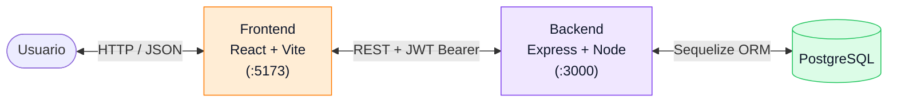

El sistema sigue una arquitectura **cliente-servidor desacoplada** con tres responsabilidades claramente separadas. El frontend y el backend viven en directorios independientes (`client/` y `server/`) con sus propios `package.json`, lo cual permite desplegarlos por separado (Vercel/Netlify para el cliente, Render/Railway para el servidor).

### Flujo de una petición autenticada

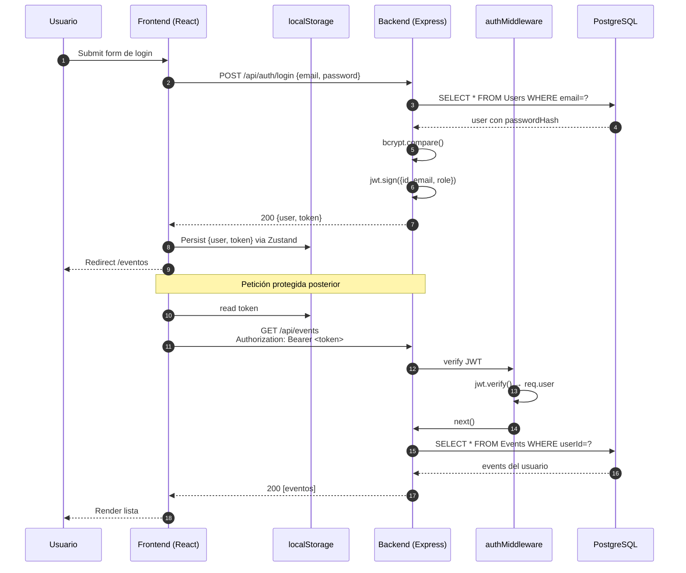

### Patrones aplicados

| Patrón | Dónde | Por qué |
|---|---|---|
| **MVC + Validators** | Backend (`controllers/`, `models/`, `routes/`, `validators/`) | Separación responsabilidades clásica de Express, facilita testing y mantenimiento |
| **Service layer** | Frontend (`services/`) | Toda comunicación HTTP centralizada; los componentes consumen funciones tipadas |
| **App factory** | `server/src/app.js` | Función `createApp()` que devuelve la app Express sin iniciar `listen()`, indispensable para Supertest |
| **Interceptor pattern** | `client/src/services/api.ts` | Inyección automática de `Bearer <token>` y manejo central de 401 |
| **Store persistido** | Zustand + `persist` middleware | Sesión sobrevive a refresh con clave `auth-storage` en localStorage |
| **Protected Route** | `<ProtectedRoute>` HOC | Redirección a `/login` si `isAuthenticated === false` |
| **Ownership check** | Controllers de Events y Tickets | `if (resource.userId !== req.user.id) return 403` |
| **Centralized error middleware** | `error.middleware.js` | Respuestas JSON consistentes; nunca HTML default de Express |

---

## 4. Estructura del proyecto

```
conference-ticket-generator/
├── .claude/                              # Launch configs para Claude Code preview
│   └── launch.json
├── docs/
│   └── images/                           # Capturas referenciadas en este README
│
├── client/                               # ── FRONTEND (React + Vite) ──
│   ├── public/
│   │   └── assets/
│   ├── src/
│   │   ├── assets/                       # SVGs inline (icon-info)
│   │   ├── components/
│   │   │   ├── auth/                     # login-form, register-form, protected-route
│   │   │   ├── confirmation-page/        # congrats, ticket, ticket-card, confirmation-page
│   │   │   ├── events-list/              # events-list, event-form
│   │   │   ├── layouts/                  # main-layout, starfield (lava lamps)
│   │   │   └── ticket-form-page/         # hero, form/{form, text-input, upload-input, button}
│   │   ├── contexts/                     # show-ticket context
│   │   ├── hooks/                        # use-show-ticket
│   │   ├── pages/                        # home, events, login, register, my-tickets
│   │   ├── services/
│   │   │   ├── api.ts                    # Instancia Axios + interceptor JWT
│   │   │   ├── authService.ts            # register, login, getMe
│   │   │   ├── eventService.ts           # CRUD eventos
│   │   │   └── ticketService.ts          # CRUD tickets
│   │   ├── store/
│   │   │   ├── auth.ts                   # Zustand + persist (token + user)
│   │   │   └── user.ts                   # Datos del ticket actual (transitorio)
│   │   ├── App.tsx                       # Router + navbar dinámico
│   │   ├── main.tsx                      # createRoot + StrictMode + ShowTicketProvider
│   │   └── index.css                     # Tokens @theme + body bg luminoso
│   ├── index.html
│   ├── package.json
│   ├── tsconfig.json
│   ├── vite.config.ts
│   └── .env.example
│
├── server/                               # ── BACKEND (Node + Express) ──
│   ├── src/
│   │   ├── config/
│   │   │   ├── database.js               # Sequelize → Postgres (dev/prod) | SQLite (tests)
│   │   │   └── swagger.js                # Spec OpenAPI 3.0.3
│   │   ├── controllers/
│   │   │   ├── auth.controller.js        # register, login, me
│   │   │   ├── event.controller.js       # CRUD eventos con ownership check
│   │   │   └── ticket.controller.js      # CRUD tickets con ownership check
│   │   ├── middlewares/
│   │   │   ├── auth.middleware.js        # Verifica JWT y pobla req.user
│   │   │   ├── error.middleware.js       # Handler central JSON
│   │   │   └── validateId.middleware.js  # Rechaza IDs no numéricos (400)
│   │   ├── models/
│   │   │   ├── Event.js                  # title, description, location, date, userId FK
│   │   │   ├── Ticket.js                 # name, email, github, avatar, userId FK
│   │   │   ├── User.js                   # name, email, passwordHash, role
│   │   │   └── index.js                  # Asociaciones hasMany / belongsTo
│   │   ├── routes/
│   │   │   ├── auth.routes.js            # Documentadas con @swagger
│   │   │   ├── event.routes.js
│   │   │   └── ticket.routes.js
│   │   ├── validators/
│   │   │   ├── authValidator.js          # Zod: registerSchema, loginSchema
│   │   │   ├── eventValidator.js         # Zod: eventSchema
│   │   │   └── ticketValidator.js        # Zod: createTicketSchema
│   │   ├── app.js                        # Factory createApp() — testeable
│   │   └── index.js                      # Bootstrap: env + listen + handlers globales
│   ├── tests/
│   │   ├── env.js                        # NODE_ENV=test + JWT_SECRET de prueba
│   │   ├── setup.js                      # globalSetup Jest
│   │   ├── teardown.js                   # globalTeardown Jest
│   │   ├── health.test.js                # Smoke bootstrap (2 tests)
│   │   ├── auth.test.js                  # 12 tests
│   │   ├── events.test.js                # 19 tests (incluye aislamiento)
│   │   └── tickets.test.js               # 17 tests (incluye aislamiento)
│   ├── jest.config.js
│   ├── package.json
│   ├── .env.example
│   └── .env                              # NO commiteado
│
├── .gitignore
└── README.md                             # Este archivo
```

---

## 5. Tecnologías utilizadas

### Frontend (`client/`)

| Tecnología | Versión | Propósito |
|---|---|---|
| **React** | 19.1.1 | Librería de UI declarativa |
| **TypeScript** | 5.9 | Tipado estático |
| **Vite** (rolldown-vite) | 7.1.14 | Bundler y dev server con HMR |
| **React Router DOM** | 7.15.1 | Routing SPA + NavLink + `<Navigate>` |
| **React Hook Form** | 7.66.1 | Manejo eficiente de formularios |
| **Zustand** | 5.0.9 | Estado global ligero con middleware `persist` |
| **Axios** | 1.16.1 | Cliente HTTP con interceptores |
| **TailwindCSS** | 4.1.16 | Utility-first CSS con tokens `@theme` |
| **@tailwindcss/vite** | 4.1.16 | Plugin Tailwind nativo de Vite |

### Backend (`server/`)

| Tecnología | Versión | Propósito |
|---|---|---|
| **Node.js** | ≥18 | Runtime |
| **Express** | 5.2.1 | Framework HTTP |
| **Sequelize** | 6.37.8 | ORM relacional |
| **PostgreSQL** | ≥14 | Base de datos productiva |
| **pg + pg-hstore** | 8.20 / 2.3 | Driver Postgres |
| **Zod** | 4.4.3 | Validación de schemas |
| **bcryptjs** | 3.0.3 | Hashing de contraseñas |
| **jsonwebtoken** | 9.0.3 | Emisión y verificación de JWT |
| **dotenv** | 17.4.2 | Carga de variables de entorno |
| **cors** | 2.8.6 | CORS configurable |
| **swagger-ui-express** | 5.0.1 | Documentación interactiva |
| **swagger-jsdoc** | 6.3.0 | Spec OpenAPI desde anotaciones JSDoc |

### Testing y desarrollo

| Tecnología | Versión | Uso |
|---|---|---|
| **Jest** | 30.4.2 | Test runner |
| **Supertest** | 7.2.2 | Tests HTTP de la API sin levantar puerto real |
| **sqlite3** | 6.0.1 | Base de datos en memoria para tests aislados |
| **nodemon** | 3.1.14 | Hot reload del backend en dev |

> **Nota sobre la base de datos**: El brief académico mencionaba MySQL. La implementación final utiliza **PostgreSQL** porque Sequelize soporta ambos con la misma API y Postgres ofrece tipos JSON nativos y mejor manejo de transacciones, ventaja relevante para la fase de roles futura. La migración a MySQL es trivial: cambiar `dialect: "postgres"` por `dialect: "mysql"` y los drivers correspondientes.

---

## 6. Instalación

### Requisitos previos

- **Node.js ≥ 18** y **npm ≥ 9**.
- **PostgreSQL ≥ 14** corriendo en `localhost:5432`.
- **Git**.

### Pasos

```bash
# 1. Clonar el repositorio
git clone https://github.com/JesusGG2109/ticket-generator.git
cd ticket-generator

# 2. Crear la base de datos en PostgreSQL
psql -U postgres -c "CREATE DATABASE eventhub_tecnm;"

# 3. Instalar dependencias del backend
cd server
npm install

# 4. Configurar variables de entorno del backend
cp .env.example .env
# Editar server/.env con tus credenciales (ver sección 7)

# 5. Instalar dependencias del frontend
cd ../client
npm install

# 6. (Opcional) Configurar variables del frontend
cp .env.example .env
```

La sincronización de tablas (`sequelize.sync()`) ocurre **automáticamente al arrancar el backend en modo desarrollo**. En producción se desactiva por seguridad — debe usarse `sequelize-cli` o migraciones manuales.

---

## 7. Variables de entorno

### Backend — `server/.env`

| Variable | Descripción | Ejemplo |
|---|---|---|
| `NODE_ENV` | Entorno (`development` / `production` / `test`) | `development` |
| `PORT` | Puerto donde escucha Express | `3000` |
| `DB_NAME` | Nombre de la base de datos | `eventhub_tecnm` |
| `DB_USER` | Usuario PostgreSQL | `postgres` |
| `DB_PASSWORD` | Contraseña PostgreSQL | `tu_password_seguro` |
| `DB_HOST` | Host de la base de datos | `localhost` |
| `DB_PORT` | Puerto PostgreSQL | `5432` |
| `JWT_SECRET` | Secreto para firmar JWT (¡cambiar en producción!) | cadena larga aleatoria |
| `JWT_EXPIRES_IN` | Tiempo de vida del token | `7d` |
| `CORS_ORIGIN` | Origen(es) permitido(s) — `*` o lista separada por comas | `*` |

### Frontend — `client/.env`

| Variable | Descripción | Ejemplo |
|---|---|---|
| `VITE_API_URL` | URL base de la API. Si se omite, usa `http://localhost:3000/api` | `https://api.tudominio.com/api` |

> **Seguridad**: ambos archivos `.env` están en `.gitignore` y **nunca deben commitearse**. Solo `.env.example` se versiona.

---

## 8. Ejecución

### Modo desarrollo

**Backend** (terminal 1):

```bash
cd server
npm run dev
```

Salida esperada:
```
[nodemon] starting `node src/index.js`
Servidor corriendo en puerto 3000
Base de datos conectada
Tablas sincronizadas
```

**Frontend** (terminal 2):

```bash
cd client
npm run dev
```

Salida esperada:
```
VITE v7.1.14  ready in 421 ms
➜  Local:   http://localhost:5173/
```

Abrir [http://localhost:5173](http://localhost:5173) en el navegador.

### Modo producción

```bash
# Backend
cd server
npm install --omit=dev
NODE_ENV=production npm start

# Frontend
cd client
npm install
npm run build           # Genera dist/
npm run preview         # Sirve dist/ localmente para verificar
```

El `dist/` del cliente puede desplegarse en Vercel/Netlify; el `server/` en Render/Railway/Fly.io.

### Scripts disponibles

**Backend** (`server/package.json`):
| Script | Acción |
|---|---|
| `npm run dev` | Arranca con nodemon (hot reload) |
| `npm start` | Arranca con node (modo producción) |
| `npm test` | Ejecuta los 50 tests con Jest |
| `npm run test:watch` | Tests en modo watch |

**Frontend** (`client/package.json`):
| Script | Acción |
|---|---|
| `npm run dev` | Arranca Vite dev server |
| `npm run build` | Compila TypeScript y genera build optimizado |
| `npm run preview` | Sirve el build localmente |
| `npm run lint` | ESLint sobre todo el código |

---

## 9. API REST

> Base URL: `http://localhost:3000/api`
> Documentación interactiva: **`/api/docs`** (Swagger UI con autenticación JWT)
> Spec JSON: **`/api/docs.json`** (OpenAPI 3.0.3 importable a Postman/Insomnia)

### Auth

| Método | Ruta | Protegido | Descripción |
|---|---|---|---|
| `POST` | `/auth/register` | No | Crea usuario y devuelve JWT |
| `POST` | `/auth/login` | No | Autentica y devuelve JWT |
| `GET` | `/auth/me` | 🔒 Sí | Devuelve el usuario autenticado |

**`POST /api/auth/register`**

Request:
```json
{
  "name": "Jesus Garcia",
  "email": "jesus@tecnm.mx",
  "password": "secret123"
}
```

Response `201`:
```json
{
  "user": { "id": 1, "name": "Jesus Garcia", "email": "jesus@tecnm.mx", "role": "user", "createdAt": "...", "updatedAt": "..." },
  "token": "eyJhbGciOiJIUzI1NiIsInR5cCI6IkpXVCJ9..."
}
```

Errores:
- `400` Datos inválidos (Zod)
- `409` Email ya registrado

### Events

> **Todas las rutas requieren JWT y devuelven únicamente los eventos del usuario autenticado.**

| Método | Ruta | Protegido | Descripción |
|---|---|---|---|
| `GET` | `/events` | 🔒 Sí | Lista los eventos del usuario (ordenados por fecha ASC) |
| `POST` | `/events` | 🔒 Sí | Crea un evento asociado al usuario |
| `GET` | `/events/:id` | 🔒 Sí | Obtiene un evento propio por ID |
| `PUT` | `/events/:id` | 🔒 Sí | Actualiza un evento propio |
| `DELETE` | `/events/:id` | 🔒 Sí | Elimina un evento propio |

**`POST /api/events`**

Request:
```json
{
  "title": "Conferencia de IA aplicada",
  "description": "Charla magistral sobre IA en educación",
  "location": "Auditorio TECNM Celaya",
  "date": "2026-09-15T18:00:00.000Z"
}
```

Response `201`: el evento creado con `userId` del autenticado.

Errores:
- `400` Datos inválidos / ID no numérico
- `401` Token ausente o inválido
- `403` Intento de acceso a evento de otro usuario
- `404` Evento no encontrado

### Tickets

> **Todas las rutas requieren JWT. Cada usuario solo ve y manipula sus propios tickets.**

| Método | Ruta | Protegido | Descripción |
|---|---|---|---|
| `POST` | `/tickets` | 🔒 Sí | Crea un ticket asociado al usuario |
| `GET` | `/tickets/me` | 🔒 Sí | Lista los tickets del usuario (más reciente primero) |
| `GET` | `/tickets/:id` | 🔒 Sí | Obtiene un ticket propio por ID |
| `DELETE` | `/tickets/:id` | 🔒 Sí | Elimina un ticket propio |

**`POST /api/tickets`**

Request:
```json
{
  "name": "Jesus Garcia",
  "email": "jesus@tecnm.mx",
  "github": "@jesusgg",
  "avatar": "data:image/png;base64,..."
}
```

`github` y `avatar` son opcionales.

Response `201`: el ticket creado con `userId` y timestamps.

### Códigos de error consistentes

| Código | Significado |
|---|---|
| `400` | Datos inválidos (Zod) / JSON malformado / ID no numérico |
| `401` | No autenticado / token inválido / token expirado |
| `403` | El recurso pertenece a otro usuario |
| `404` | Recurso no encontrado |
| `409` | Email ya registrado |
| `413` | Payload demasiado grande |
| `500` | Error interno (sanitizado en producción) |

### Utilidades

| Método | Ruta | Descripción |
|---|---|---|
| `GET` | `/` | Bienvenida |
| `GET` | `/api/health` | Healthcheck (uptime, environment, timestamp) |
| `GET` | `/api/docs` | Swagger UI |
| `GET` | `/api/docs.json` | Spec OpenAPI 3.0.3 |

---

## 10. Base de datos

### Modelo entidad-relación

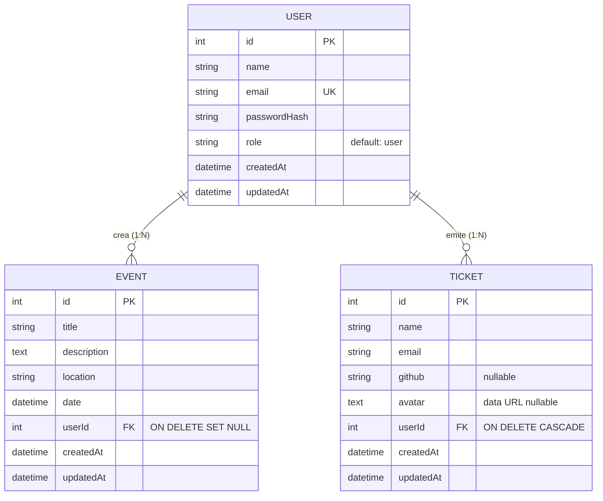

### Asociaciones Sequelize

```js
// server/src/models/index.js
User.hasMany(Event,  { foreignKey: "userId", as: "events",  onDelete: "SET NULL" });
Event.belongsTo(User, { foreignKey: "userId", as: "owner" });

User.hasMany(Ticket, { foreignKey: "userId", as: "tickets", onDelete: "CASCADE" });
Ticket.belongsTo(User, { foreignKey: "userId", as: "owner" });
```

**Decisión técnica:** los eventos usan `SET NULL` al borrar usuario (un evento puede quedar huérfano sin destruirse), mientras que los tickets usan `CASCADE` (al borrar un usuario, sus tickets se borran con él porque carecen de sentido independiente).

---

## 11. Flujo de usuario

```mermaid
flowchart TD
    Start([Usuario abre la app]) --> Home[Visita Home]
    Home --> Decision{¿Tiene cuenta?}
    Decision -->|No| Register[/register]
    Decision -->|Sí| Login[/login]
    Register --> Token1[Recibe JWT y se guarda en Zustand persist]
    Login --> Token2[Recibe JWT y se guarda en Zustand persist]
    Token1 --> Eventos
    Token2 --> Eventos

    Eventos[/eventos] --> CreaEvento[Click Nuevo evento]
    CreaEvento --> FormEvento[Llena title/desc/location/date]
    FormEvento --> POSTEvento[POST /api/events con userId del JWT]
    POSTEvento --> Eventos

    Home --> GeneraTicket[Click Generar mi ticket]
    GeneraTicket --> FormTicket[Llena name/email/github + avatar]
    FormTicket --> POSTTicket[POST /api/tickets con userId del JWT]
    POSTTicket --> Confirmacion[Confirmation Page muestra boarding pass]

    Confirmacion --> MisTickets[/mis-tickets]
    Eventos --> MisTickets

    MisTickets --> RefreshSafe[Refrescar la página sigue mostrando todo]

    style Token1 fill:#FFEDD5,stroke:#FF7A00
    style Token2 fill:#FFEDD5,stroke:#FF7A00
    style POSTEvento fill:#F0E7FF,stroke:#8B5CF6
    style POSTTicket fill:#F0E7FF,stroke:#8B5CF6
    style RefreshSafe fill:#DCFCE7,stroke:#22C55E
```

---

## 12. Capturas del sistema

> Los archivos viven en `docs/images/`. Mientras no tengas las capturas reales, los placeholders SVG dan una idea del layout esperado. Reemplázalos por PNG 1920×1080 cuando estén listos.

### Home — Hero con lava lamps

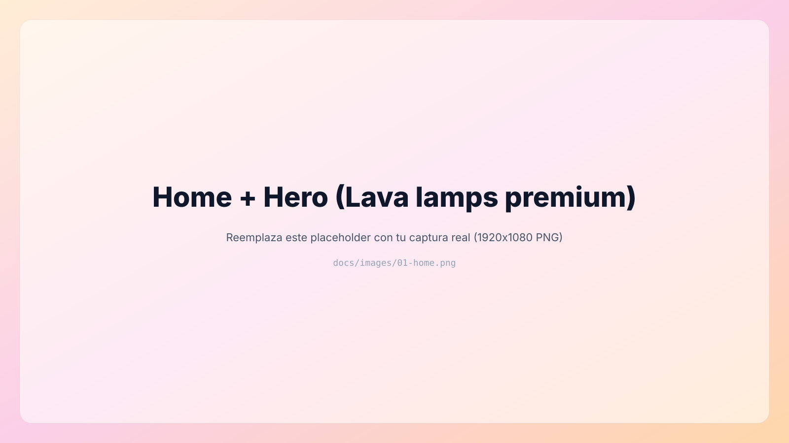

*El Hero invita al usuario a generar su ticket. Las 7 lava lamps cálidas (naranja, ámbar, coral, magenta, rosa, cyan acento) se mueven detrás del contenido con `mix-blend-mode: multiply` sobre el fondo `#F8FAFF`, creando mezcla cromática real cuando se solapan.*

### Login

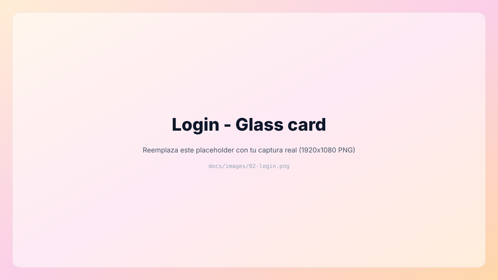

*Card glass premium con badge "Acceso", inputs con focus naranja, CTA `Iniciar sesion` con gradiente naranja → magenta y sombra cinematográfica.*

### Registro

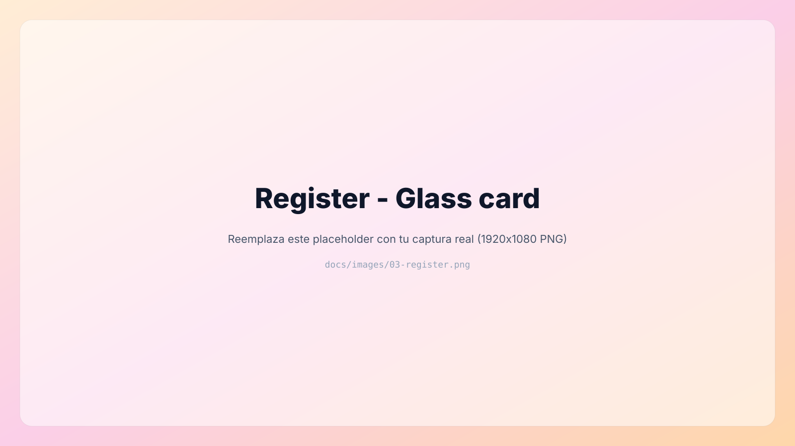

*Mismo lenguaje visual que login. Tras el registro exitoso, el usuario es redirigido automáticamente a `/eventos`.*

### Lista de eventos

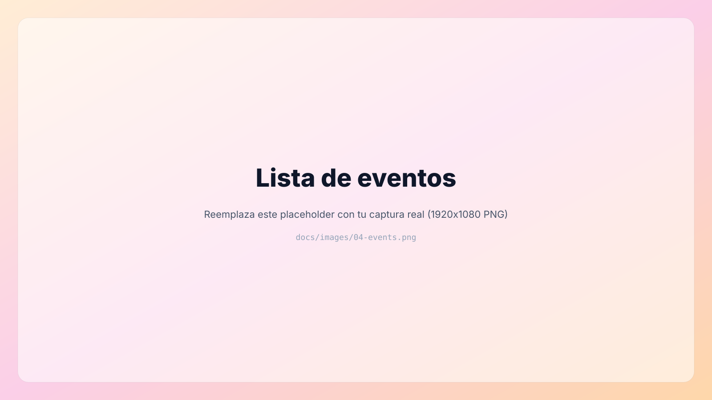

*Cada evento se muestra como card glass con título, fecha, descripción y ubicación. Acciones inline para editar y eliminar. Cada usuario ve únicamente sus eventos.*

### Formulario de creación de evento

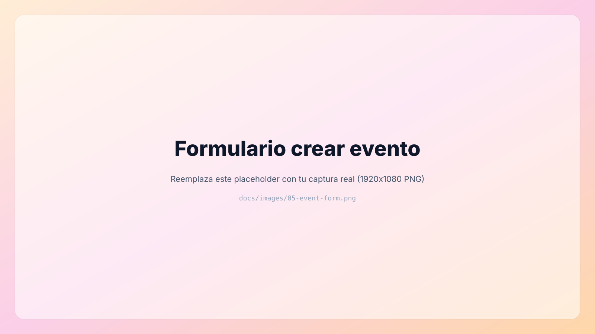

*Modal inline para registrar un nuevo evento con título, descripción, ubicación y fecha. Validación en cliente con react-hook-form y en servidor con Zod.*

### Mis tickets

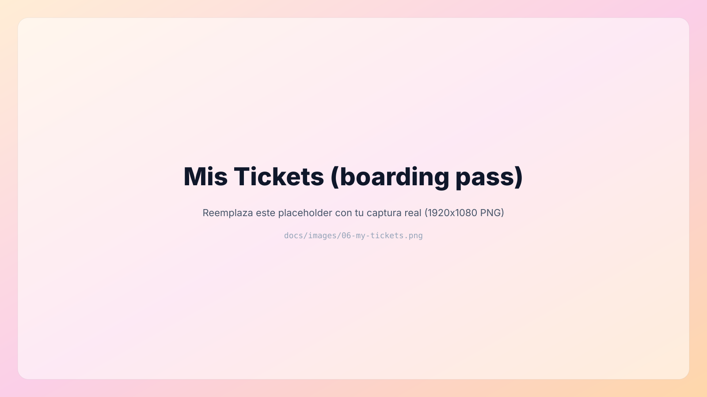

*Boarding pass premium con vidrio claro, glow cálido exterior, separador perforado al color del canvas y datos personalizados del asistente.*

### Confirmación tras generar ticket

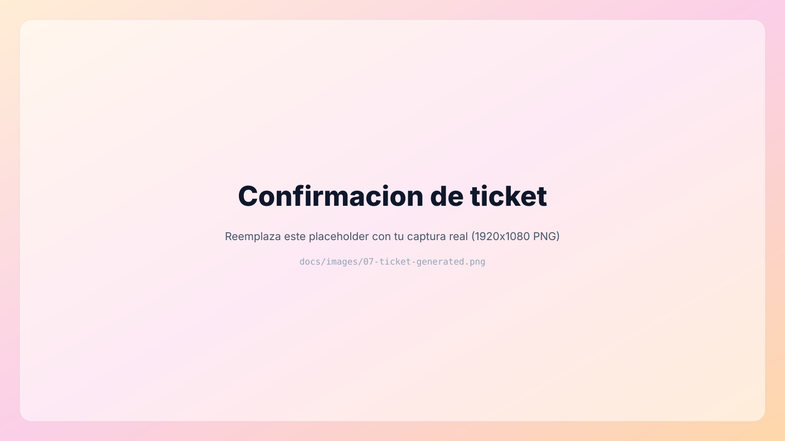

*Página de confirmación con saludo personalizado por gradiente y el ticket recién emitido en boarding pass.*

### Swagger UI

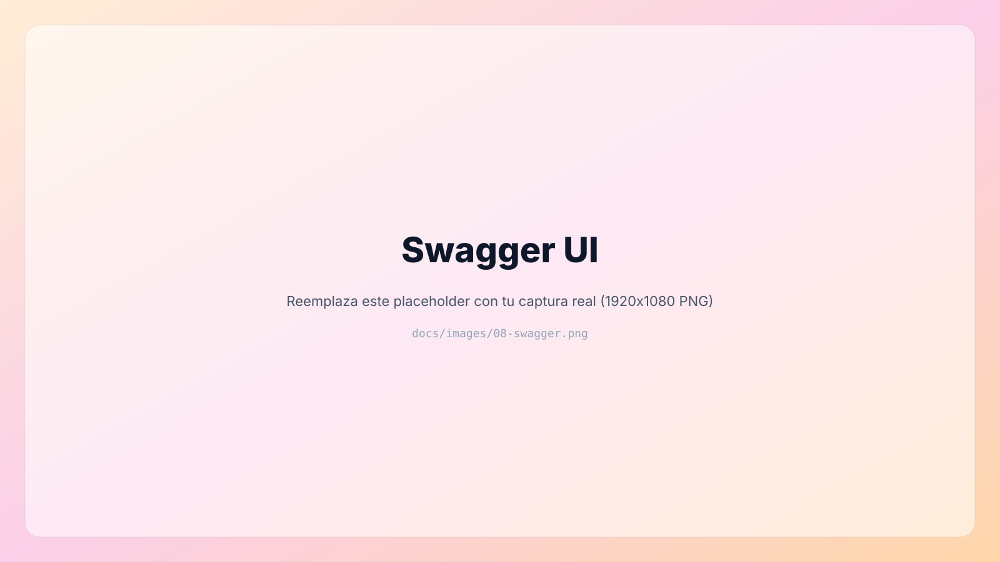

*Documentación interactiva con autenticación JWT. Permite probar todos los endpoints sin escribir una línea de código adicional.*

---

## 13. Testing

El backend tiene **50 tests automatizados** con **Jest 30 + Supertest** corriendo contra una base **SQLite en memoria** vía Sequelize. Esto permite ejecutar la suite sin necesidad de Postgres y garantiza aislamiento total entre tests.

### Ejecutar

```bash
cd server
npm test            # Toda la suite
npm run test:watch  # Modo watch
```

### Suites incluidas

| Archivo | Cobertura | Tests |
|---|---|---|
| `tests/health.test.js` | Bootstrap de Express + dialect SQLite | 2 |
| `tests/auth.test.js` | Register, login, GET /me (happy, errores, bcrypt hashing, formatos de token) | 12 |
| `tests/events.test.js` | CRUD eventos + protección JWT + 5 tests de aislamiento entre usuarios | 19 |
| `tests/tickets.test.js` | CRUD tickets + protección JWT + 4 tests de aislamiento + orden DESC | 17 |
| **Total** | | **50** |

### Cómo funciona el entorno de test

- `tests/env.js` establece `NODE_ENV=test` y un `JWT_SECRET` de prueba.
- `server/src/config/database.js` detecta `NODE_ENV === "test"` y usa `sqlite::memory:` en lugar de Postgres.
- Cada suite hace `sequelize.sync({ force: true })` y un `truncate` por `beforeEach` para garantizar aislamiento.
- `server/src/app.js` exporta una factory `createApp()` que Supertest importa sin levantar puerto real.

### Ejemplo: prueba de aislamiento de tickets

```js
describe("Aislamiento entre usuarios", () => {
  let tokenA, tokenB, ticketA;

  beforeEach(async () => {
    /* registra usuarios A y B; A crea ticket */
  });

  it("User B no ve el ticket de A en su listado", async () => {
    const res = await request(app)
      .get("/api/tickets/me")
      .set({ Authorization: `Bearer ${tokenB}` });
    expect(res.body).toEqual([]);                  // ← prueba aislamiento real
  });

  it("User B recibe 403 al intentar eliminar ticket de A", async () => {
    const res = await request(app)
      .delete(`/api/tickets/${ticketA.id}`)
      .set({ Authorization: `Bearer ${tokenB}` });
    expect(res.status).toBe(403);
  });
});
```

---

## 14. Decisiones de ingeniería de software

### Por qué arquitectura cliente-servidor desacoplada

El `client/` y `server/` viven en directorios independientes con `package.json` separados. Esto permite:
- Desplegar cada uno en plataformas especializadas (Vercel/Netlify para SPAs, Render/Railway para APIs Node).
- Iterar en frontend sin reiniciar el backend y viceversa.
- Migrar el frontend a otro framework sin tocar el backend (las APIs son agnósticas).

### Por qué JWT en lugar de sesiones cookie-based

- **Stateless**: el backend no necesita guardar estado de sesión.
- **Portable**: el token funciona desde Postman, curl, móvil sin configuración adicional.
- **Escalable**: cualquier instancia del backend puede verificar el token sin coordinación.
- **Mockeable en tests**: Supertest envía el header sin manejar cookies.

### Por qué Zustand en lugar de Redux

- **80% menos boilerplate**: tres líneas para un store básico.
- **Middleware `persist` integrado**: una opción para persistir en localStorage.
- **Sin Provider obligatorio**: cualquier componente accede directo al store.

### Por qué Zod en lugar de Joi/Yup

- **Inferencia de tipos TypeScript** desde el schema sin duplicación.
- **Mensajes de error en español** definidos en el propio schema.
- **API moderna** con `.parse()` y `.safeParse()`.

### Por qué Sequelize sobre Prisma

- Mayor portabilidad entre Postgres / MySQL / SQLite sin cambios de código.
- No requiere paso de generación adicional al build.
- Soporta perfectamente el uso de SQLite en memoria para tests, lo cual fue determinante para el suite de 50 pruebas.

### Por qué Swagger desde JSDoc

- La documentación vive **junto al código** que documenta.
- Se mantiene actualizada al modificar el endpoint.
- `swagger-ui-express` levanta la UI sin necesidad de servir HTML adicional.

### Por qué `mix-blend-mode: multiply` en las lava lamps

Sobre fondo claro, `multiply` produce colores saturados como tinta o acuarela. Cuando dos lavas se solapan, sus colores se mezclan cromáticamente (naranja + magenta = magenta-rojo profundo). Esto reproduce el efecto físico de una lámpara de lava real, en contraste con los blobs CSS planos típicos.

---

## 15. Retos encontrados

Durante el desarrollo aparecieron varios problemas no triviales que requirieron debugging profundo y refactorización deliberada. Los más relevantes documentados en el historial de commits:

### 15.1 Render bloqueado por z-index negativo + background opaco

**Síntoma:** el fondo decorativo se renderizaba (verificado con `console.log`) pero la pantalla seguía completamente plana, sin colores visibles.

**Causa raíz:** el `<Starfield>` usaba `position: fixed inset-0 -z-10`. El selector `html, body, #root { background-color: #050816 }` aplicaba un fondo opaco al `#root`. Como el wrapper padre tenía `position: relative` **sin `z-index` ni `isolation`**, no creaba un nuevo stacking context, así que el `z-index: -10` del `Starfield` se escapaba al stacking context raíz del documento, donde quedaba **detrás del background sólido del `#root`**.

**Diagnóstico:** se aplicó un test prescriptivo (`<div style="position:fixed; inset:0; background:red; z-index:999999">`) y se comprobó que el rojo SÍ aparecía con z-index positivo extremo pero NO con z-index negativo. Eso aisló la variable.

**Corrección:** una sola línea en `main-layout.tsx`:
```diff
- <div className='relative min-h-screen ...'>
+ <div className='relative isolate min-h-screen ...'>
```

El `isolate` (utility de Tailwind para `isolation: isolate`) crea un stacking context que actúa como techo, evitando que el z-index negativo se escape.

### 15.2 Crash del backend tras refactor por unhandled rejection

**Síntoma:** `[nodemon] app crashed` aparecía después de arrancar el server, sin stack trace visible. La consola mostraba los 3 mensajes de boot exitoso y luego se moría silenciosamente.

**Causa raíz:** `sequelize.sync()` en `index.js` no tenía `.catch()`. En Node 15+ una unhandled promise rejection mata el proceso por defecto.

**Corrección:** se agregaron handlers globales `process.on('unhandledRejection')` y `process.on('uncaughtException')` + `.catch()` explícito a `sync()`. También se creó `error.middleware.js` central para que todas las respuestas sean JSON consistentes (Express por defecto responde HTML en errores no manejados).

### 15.3 Tickets desaparecían al refrescar la página

**Síntoma:** el usuario generaba un ticket, se mostraba correctamente, aparecía en `/mis-tickets`, refrescaba el navegador y todo desaparecía.

**Causa raíz auditoría completa:** el sistema de tickets era 100% client-side y vivía en memoria:
- `store/user.ts` era Zustand **sin `persist`** → memoria RAM.
- `ShowTicketContext` usaba `useState<boolean>` → memoria RAM.
- El form `setUser()` + `setShowTicket(true)` **nunca llamaba al backend**.
- El avatar era `URL.createObjectURL(file)` → blob URL efímera del navegador, ni siquiera serializable.
- **La tabla `Tickets` no existía** en el backend.

**Bug crítico adicional encontrado en el mismo audit:** `clearAuth()` no limpiaba `useUserStore`, así que al cerrar sesión User A e iniciar User B, **B veía los datos del ticket de A** porque el store local seguía intacto.

**Corrección:** se creó la entidad Ticket en backend (modelo + validador + controller + rutas + Swagger + 17 tests), un `ticketService.ts` en frontend, se reescribió `MyTicketsPage` para consumir el backend, se cambió el avatar a data URL persistible, y se hizo que `clearAuth()` limpiara también el user store. La separación entre usuarios se validó con 4 tests automatizados de aislamiento.

### 15.4 Cross-user data leak en eventos

**Síntoma:** al iniciar sesión con cualquier usuario, todos veían los mismos eventos.

**Causa raíz:** el modelo `Event` no tenía columna `userId` ni asociación Sequelize. Las rutas `/api/events/*` eran **completamente públicas** sin `authMiddleware`. `getEvents` hacía `Event.findAll()` global.

**Corrección:** se agregó `userId` con FK (preservando los 5 eventos legacy con `userId = NULL`), se declararon las relaciones `User.hasMany(Event)` y `Event.belongsTo(User)`, se aplicó `authMiddleware` a las 5 rutas, se filtró `getEvents` por `WHERE userId = req.user.id`, y se agregó ownership check con respuesta 403 en `GET /:id`, `PUT` y `DELETE`. Reforzado con 5 tests de aislamiento.

### 15.5 Crash falso por procesos zombie

**Síntoma:** al ejecutar `npm run dev`, nodemon imprimía `[nodemon] app crashed` aunque el código fuente estaba intacto y los tests pasaban.

**Causa raíz:** 5 procesos node de iteraciones previas (preview servers, instancias zombie de horas anteriores) seguían vivos. Uno de ellos retenía el puerto 3000, así que el `app.listen(3000)` de la nueva instancia fallaba con `EADDRINUSE` y nodemon reportaba "app crashed".

**Corrección:** se ejecutó `Get-Process node | Stop-Process -Force` para limpiar los zombies y se documentó el comando en este README. **No había ningún bug en el código**.

---

## 16. Resultados obtenidos

### Métricas finales

| Métrica | Valor |
|---|---|
| Commits semánticos | 56 |
| Archivos fuente backend | 18 |
| Archivos fuente frontend | 27 |
| Líneas de código backend (sin tests) | ~1,400 |
| Líneas de código frontend (sin assets) | ~2,800 |
| Tests automatizados | 50 (todos pasando) |
| Endpoints REST documentados | 12 |
| Tiempo de build frontend | ~280 ms (Vite + rolldown) |
| Tamaño bundle JS gzipped | ~112 KB |
| Tamaño bundle CSS gzipped | ~7.3 KB |
| Tiempo total de la suite de tests | ~7.5 segundos |

### Funcionalidades entregadas

- ✅ Sistema completo de autenticación JWT con persistencia y auto-logout.
- ✅ CRUD de eventos aislado por usuario con validación dual (Zod + react-hook-form).
- ✅ Sistema de tickets persistente con boarding pass premium y data URL para avatar.
- ✅ Documentación API interactiva con Swagger UI y spec OpenAPI 3.0.3.
- ✅ Suite de tests con SQLite en memoria garantizando aislamiento total.
- ✅ Tema visual luminoso premium con 7 lava lamps animadas vía `mix-blend-mode: multiply`.
- ✅ Estructura preparada para deploy en plataformas modernas.

---

## 17. Trabajo en equipo

### Participantes

| Integrante | Rol principal |
|---|---|
| **Jesús Grangeno García** | Desarrollo fullstack, arquitectura, autenticación, gestión del repositorio |
| **César Eduardo Martínez Arredondo** | Documentación técnica, pruebas funcionales, revisión de UX |

### Contribuciones reflejadas en Git

El historial de commits del repositorio `JesusGG2109/ticket-generator` muestra **63 commits firmados por `JesusGG2109`**, además de 6 commits ancestros de la plantilla base de la cual se forkó el proyecto. La línea de trabajo se concentra en la rama `jesus-dev` con commits semánticos en español agrupados por funcionalidad (autenticación, CRUD, testing, documentación, diseño).

```bash
$ git shortlog -s -n
    63  JesusGG2109
     4  CodinGitHub        # autores de la plantilla base original
     1  CodingTube
     1  Davichobits
```

César Eduardo Martínez Arredondo participó en las revisiones funcionales y en la elaboración de la documentación técnica fuera del sistema de control de versiones.

### Metodología de trabajo

- **Trabajo por ramas**: toda la implementación nueva en `jesus-dev`. `main` queda intacta hasta validación.
- **Commits atómicos**: cada commit cubre una funcionalidad coherente con mensaje en español describiendo el "qué" (no el "cómo").
- **Workflow incremental**: cada fase (autenticación → CRUD eventos → tickets → tema visual) es independiente y revertible.

---

## 18. Conclusiones

El proyecto **EventHub TECNM** demuestra de forma práctica los principios fundamentales de la **Ingeniería de Software** aplicados a un sistema web fullstack de complejidad moderada. La construcción se realizó de forma incremental, con 56 commits semánticos que documentan cada decisión técnica y su justificación, lo cual permite auditar el proceso de desarrollo de principio a fin.

La separación clara entre frontend y backend en directorios independientes no fue una decisión estética sino una **decisión arquitectónica deliberada**: facilita el despliegue independiente, permite que cada capa evolucione a su propio ritmo y refleja la realidad industrial donde APIs y SPAs viven en infraestructuras distintas. La aplicación de patrones clásicos (MVC + Validators en backend, Service Layer + Interceptors en frontend, App Factory para testabilidad) demuestra que las soluciones probadas en la industria son perfectamente trasladables a un proyecto académico, sin sacrificar claridad ni mantenibilidad.

El proceso reveló problemas no triviales que solo aparecen en sistemas reales: stacking contexts CSS que ocultan elementos visualmente correctos, unhandled promise rejections que matan procesos silenciosamente, blob URLs que se evaporan al refrescar, y data leaks entre usuarios por ausencia de filtros en queries. Cada uno de estos retos fue **diagnosticado con metodología sistemática** (reproducir, aislar, hipotetizar, validar, corregir) en lugar de aplicar parches superficiales. Las correcciones se documentaron en commits específicos para que sirvan de referencia futura.

La **suite de 50 tests automatizados** con Jest + Supertest contra una base SQLite en memoria es probablemente el aporte más relevante desde la perspectiva de Ingeniería de Software. Demuestra que es posible escribir tests rápidos, aislados y deterministas para una API completa sin depender de bases de datos externas ni procesos paralelos. Los 5 tests específicos de **aislamiento entre usuarios** (donde User A crea recursos, User B intenta accederlos, y se valida que reciba 403) representan la prueba viva del compromiso del sistema con la seguridad multiusuario.

El último aspecto, la **dirección visual del producto**, se construyó como ejercicio de iteración crítica: se exploraron al menos seis estilos distintos (espacial, reactor energético, horizonte digital, SaaS premium oscuro, luminoso con auroras y finalmente lava lamps cálidas) antes de converger en una identidad coherente con los objetivos académicos del proyecto. Esta búsqueda visual, lejos de ser superficial, demuestra que la **experiencia del usuario es un componente medible** del software profesional y que la calidad técnica debe acompañarse de una capa visual digna del producto. La meta no era impresionar con efectos, sino transmitir confianza: que la aplicación pueda mirarse y sentirse como un producto pensado, no como un prototipo escolar genérico.

En conjunto, EventHub TECNM no es solo un cumplimiento de los requisitos de la asignatura, sino una pequeña pieza de portafolio que ilustra cómo se diseña, construye, prueba, documenta y mantiene una aplicación web moderna desde cero, con criterios profesionales aplicables al mundo laboral.

---

## 19. Futuras mejoras

### Funcionalidad
- [ ] **Roles y autorización**: añadir `admin` con permisos elevados (ver todos los eventos, eliminar tickets ajenos).
- [ ] **Asociación User ↔ Event en UI**: mostrar el nombre del organizador en cada card.
- [ ] **Filtros avanzados** de eventos por rango de fecha, ubicación, palabras clave.
- [ ] **Paginación** en `GET /events` y `GET /tickets/me` con `?limit=&offset=` (importante con muchos registros).
- [ ] **Notificaciones por correo** al generar un ticket o al acercarse la fecha del evento.
- [ ] **Generación de PDF** del boarding pass para descarga / impresión.
- [ ] **Código QR único** por ticket para validación en el evento.
- [ ] **Dashboard de organización** con métricas (eventos activos, tickets emitidos, asistentes únicos).
- [ ] **Búsqueda de eventos públicos** para usuarios que quieran inscribirse.

### Calidad técnica
- [ ] **Tipos compartidos** entre cliente y servidor (workspace npm con paquete `shared`).
- [ ] **Tests automatizados frontend** con Vitest + React Testing Library.
- [ ] **CI básico** con GitHub Actions (lint + build + test en PR).
- [ ] **Migraciones Sequelize** en lugar de `sync()` para producción real.
- [ ] **Rate limiting** en endpoints públicos (`express-rate-limit`).
- [ ] **Helmet** para headers de seguridad estándar.
- [ ] **Compresión gzip/brotli** del bundle Vite.
- [ ] **Service Worker / PWA** para soporte offline básico.

### Infraestructura
- [ ] **Deploy real** en Render (backend) + Vercel (frontend).
- [ ] **Docker Compose** para arrancar Postgres + backend + frontend con un solo comando.
- [ ] **Variables de entorno gestionadas** con un secret manager (1Password / Doppler).
- [ ] **Monitoring** con Sentry o similar.
- [ ] **Backups automáticos** de la base de datos.

---

## 20. Licencia

Proyecto académico desarrollado para la asignatura de **Ingeniería de Software** en el **Tecnológico Nacional de México**. Uso libre con fines educativos citando la fuente y a los autores.

---

<div align="center">

**EventHub TECNM** — *Ingeniería de Software 2026*

Jesús Grangeno García · César Eduardo Martínez Arredondo

[Reportar issue](https://github.com/JesusGG2109/ticket-generator/issues) · [Ver código](https://github.com/JesusGG2109/ticket-generator)

</div>
