<div align="center">

# EventHub TECNM

### Sistema web para la gestión de eventos académicos y generación de tickets digitales

**Proyecto integrador de la asignatura de Ingeniería de Software**
*Tecnológico Nacional de México*

[](https://react.dev)
[](https://www.typescriptlang.org)
[](https://vitejs.dev)
[](https://tailwindcss.com)
[](https://nodejs.org)
[](https://expressjs.com)
[](https://www.postgresql.org)
[](https://sequelize.org)
[](https://jwt.io)
[](./server/src/config/swagger.js)
[](./server/tests)

</div>

---

##  Probar aplicación

La aplicación está pensada para ser desplegada en un proveedor cloud y consultada en línea.

<div align="center">

[](DEPLOY_URL_AQUI)

</div>

>  **No es necesario instalar nada** para probar el sistema una vez publicado.
> Si prefieres ejecutarlo localmente, sigue las instrucciones de [Instalación](#6-instalación).

---

## Tabla de contenidos

- [1. Descripción general](#1-descripción-general)
- [2. Vista previa](#2-vista-previa)
- [3. Funcionalidades](#3-funcionalidades)
- [4. Tecnologías utilizadas](#4-tecnologías-utilizadas)
- [5. Arquitectura del sistema](#5-arquitectura-del-sistema)
- [6. Instalación](#6-instalación)
- [7. Variables de entorno](#7-variables-de-entorno)
- [8. Ejecución](#8-ejecución)
- [9. API REST](#9-api-rest)
- [10. Base de datos](#10-base-de-datos)
- [11. Flujo de usuario](#11-flujo-de-usuario)
- [12. Estructura del proyecto](#12-estructura-del-proyecto)
- [13. Testing](#13-testing)
- [14. Metodología](#14-metodología)
- [15. Artefactos del proyecto](#15-artefactos-del-proyecto)
- [16. Decisiones de ingeniería de software](#16-decisiones-de-ingeniería-de-software)
- [17. Retos encontrados](#17-retos-encontrados)
- [18. Resultados obtenidos](#18-resultados-obtenidos)
- [19. Equipo](#19-equipo)
- [20. Conclusiones](#20-conclusiones)
- [21. Futuras mejoras](#21-futuras-mejoras)
- [22. Licencia](#22-licencia)

---

## 1. Descripción general

**EventHub TECNM** es el proyecto integrador desarrollado para la asignatura de **Ingeniería de Software** del Tecnológico Nacional de México. Como parte de la materia, el profesor planteó al grupo construir un sistema web a partir de dos opciones permitidas:

- Carrito de compras
- Generador de tickets

Nuestro equipo eligió la **segunda opción**: un generador de tickets enfocado en eventos académicos. A partir de esa base, el proyecto fue evolucionando conforme el profesor introducía nuevos requisitos durante el semestre (autenticación, gestión de eventos asociada al usuario, persistencia real de tickets, documentación de API, pruebas automatizadas y una dirección visual coherente), hasta consolidarse en lo que hoy se entrega como **EventHub TECNM**.

El proyecto no responde a una necesidad empresarial real ni a un cliente externo: es un ejercicio académico cuyo valor reside en la aplicación práctica de los conceptos de Ingeniería de Software — separación de responsabilidades, control de versiones, validación, pruebas, documentación y trabajo en equipo.

---

## 2. Vista previa

> Las imágenes viven en `docs/images/`. Mientras no se sustituyan por capturas reales, se muestran placeholders SVG con el layout esperado. Reemplázalos por PNG (1920×1080) con el mismo nombre y la sección se actualizará automáticamente.

| Vista | Captura |
|---|---|
| Home — Hero con lava lamps | 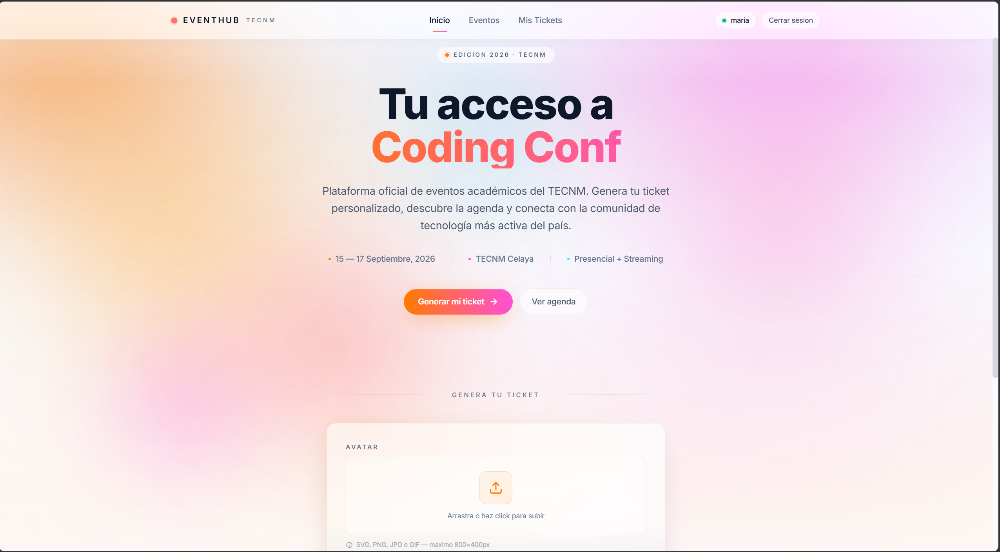 |
| Login | 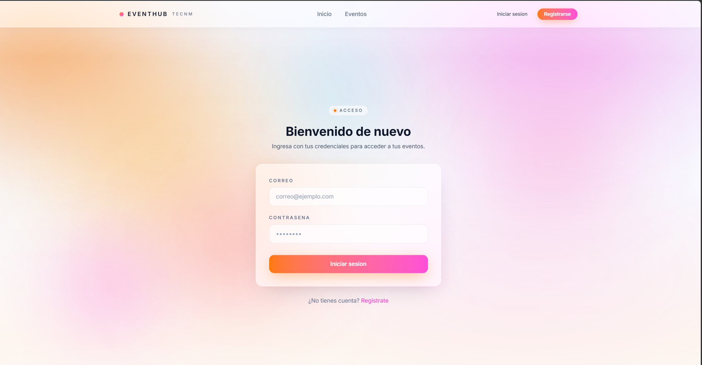 |
| Registro | 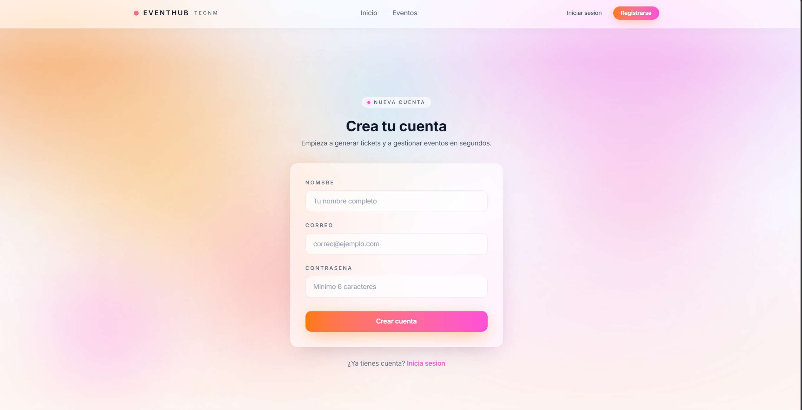 |
| Lista de eventos | 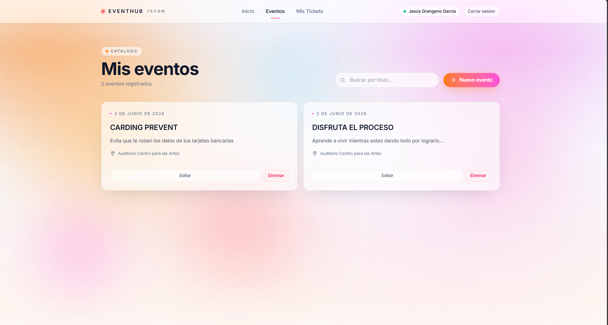 |
| Formulario de creación de evento | 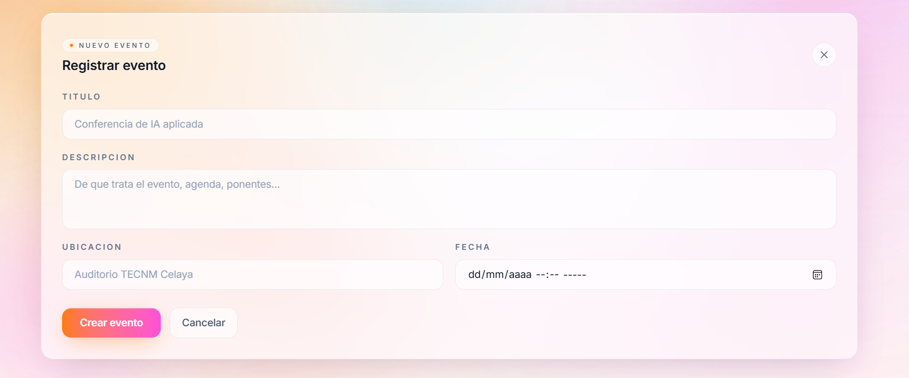 |
| Mis tickets | 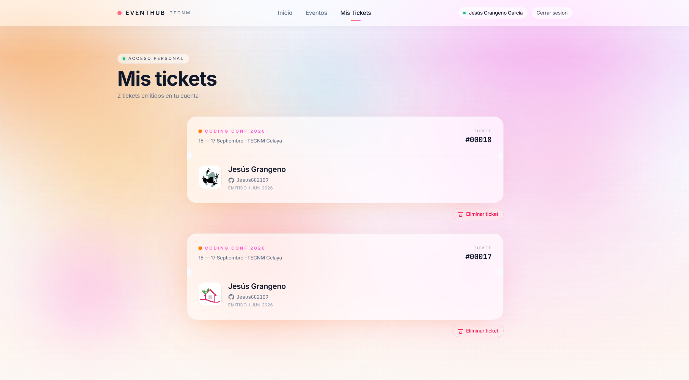 |
| Swagger UI (documentación interactiva) | 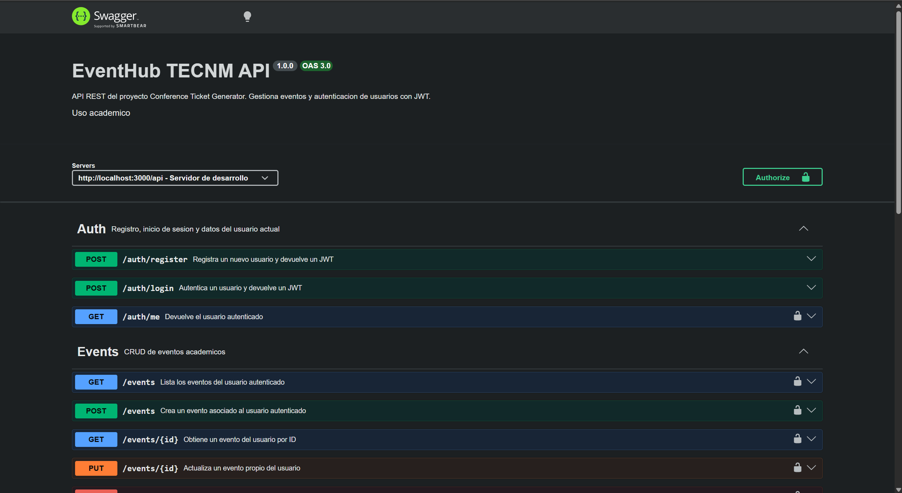 |

---

## 3. Funcionalidades

| Categoría | Funcionalidad | Estado |
|---|---|:---:|
| **Autenticación** | Registro de usuarios con email único | ✅ |
| | Inicio de sesión con verificación bcrypt | ✅ |
| | Emisión de JSON Web Tokens (JWT) firmados | ✅ |
| | Middleware de protección de rutas backend | ✅ |
| | Endpoint `GET /api/auth/me` | ✅ |
| | Persistencia de sesión en `localStorage` (Zustand `persist`) | ✅ |
| | Interceptor Axios que inyecta `Bearer <token>` | ✅ |
| | Auto-logout cuando el backend responde 401 | ✅ |
| | Rutas privadas en frontend con `<ProtectedRoute>` | ✅ |
| | Navbar dinámico según estado de sesión | ✅ |
| **Eventos** | CRUD completo (crear, listar, editar inline, eliminar) | ✅ |
| | Cada evento queda asociado al usuario que lo creó (`userId` FK) | ✅ |
| | Listado scopeado: cada usuario ve únicamente sus eventos | ✅ |
| | Búsqueda por título en cliente | ✅ |
| | Validación dual con Zod (backend) y react-hook-form (frontend) | ✅ |
| | Comprobación de propiedad (403 si pertenece a otro usuario) | ✅ |
| **Tickets** | Generación de ticket personalizado desde el Hero | ✅ |
| | Subida de avatar como data URL persistible | ✅ |
| | Diseño de boarding pass premium (vidrio claro, glow, separador perforado) | ✅ |
| | Página `/mis-tickets` con listado, contador y eliminación | ✅ |
| | Orden DESC por fecha de creación | ✅ |
| | Persistencia real (sobreviven refresh, logout y cambios de dispositivo) | ✅ |
| | Aislamiento entre usuarios verificado con tests automatizados | ✅ |
| **Infraestructura** | 50 tests automatizados con Jest + Supertest | ✅ |
| | Documentación interactiva Swagger UI / OpenAPI 3.0 en `/api/docs` | ✅ |
| | Endpoint de healthcheck `/api/health` | ✅ |
| | Variables de entorno separadas con `.env.example` versionado | ✅ |
| | Manejador centralizado de errores con respuestas JSON consistentes | ✅ |
| | Middleware de validación de IDs numéricos | ✅ |
| | Handlers globales `uncaughtException` y `unhandledRejection` | ✅ |
| | CORS configurable vía `CORS_ORIGIN` | ✅ |
| **Experiencia visual** | Tema luminoso "Lava Lamps Premium" inspirado en Vision Pro / Linear / Arc | ✅ |
| | 7 masas orgánicas animadas con `mix-blend-mode: multiply` | ✅ |
| | Glassmorphism real estilo iOS / visionOS con bordes iluminados | ✅ |
| | Botón primary con gradiente naranja → magenta | ✅ |
| | Tipografía Inter + JetBrains Mono | ✅ |
| | Contraste AAA en texto principal | ✅ |
| | Respeto a `prefers-reduced-motion` | ✅ |
| | Diseño responsive (mobile / tablet / desktop) | ✅ |

---

## 4. Tecnologías utilizadas

### Frontend

[](https://react.dev)
[](https://www.typescriptlang.org)
[](https://vitejs.dev)
[](https://tailwindcss.com)
[](https://reactrouter.com)
[](https://zustand-demo.pmnd.rs)
[](https://axios-http.com)
[](https://react-hook-form.com)

| Tecnología | Versión | Uso |
|---|---|---|
| React | 19.1.1 | Librería de UI declarativa |
| TypeScript | 5.9 | Tipado estático |
| Vite (rolldown) | 7.1.14 | Bundler y dev server con HMR |
| React Router DOM | 7.15.1 | Routing SPA |
| React Hook Form | 7.66.1 | Manejo eficiente de formularios |
| Zustand | 5.0.9 | Estado global con middleware `persist` |
| Axios | 1.16.1 | Cliente HTTP con interceptores |
| TailwindCSS | 4.1.16 | Utility-first CSS con tokens `@theme` |

### Backend

[](https://nodejs.org)
[](https://expressjs.com)
[](https://sequelize.org)
[](https://jwt.io)
[](https://zod.dev)
[](./server/src/config/swagger.js)

| Tecnología | Versión | Uso |
|---|---|---|
| Node.js | ≥ 18 | Runtime |
| Express | 5.2.1 | Framework HTTP |
| Sequelize | 6.37.8 | ORM relacional |
| Zod | 4.4.3 | Validación de schemas |
| bcryptjs | 3.0.3 | Hashing de contraseñas |
| jsonwebtoken | 9.0.3 | Emisión y verificación de JWT |
| dotenv | 17.4.2 | Carga de variables de entorno |
| cors | 2.8.6 | CORS configurable |
| swagger-ui-express | 5.0.1 | Documentación interactiva |
| swagger-jsdoc | 6.3.0 | Spec OpenAPI desde anotaciones JSDoc |

### Base de datos

[](https://www.postgresql.org)
[](https://www.sqlite.org)

| Tecnología | Uso |
|---|---|
| PostgreSQL ≥ 14 | Base de datos productiva y de desarrollo |
| SQLite (en memoria) | Base de datos para los 50 tests automatizados |
| pg / pg-hstore | Drivers PostgreSQL para Sequelize |

### Herramientas de desarrollo

[](https://jestjs.io)
[](https://github.com/ladjs/supertest)
[](https://git-scm.com)
[](https://github.com/JesusGG2109/ticket-generator)
[](https://nodemon.io)
[](https://eslint.org)

| Herramienta | Uso |
|---|---|
| Jest | Test runner para la suite del backend |
| Supertest | Tests HTTP de la API sin levantar puerto real |
| Nodemon | Hot reload del backend en desarrollo |
| ESLint | Linter del código frontend |
| Git | Control de versiones |
| GitHub | Hosting del repositorio y tablero de gestión |

---

## 5. Arquitectura del sistema

### Visión general

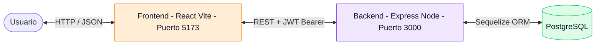

El sistema sigue una arquitectura **cliente-servidor desacoplada** con tres responsabilidades claramente separadas. El frontend y el backend viven en directorios independientes (`client/` y `server/`) con sus propios `package.json`, lo cual permite desplegarlos por separado.

### Flujo de una petición autenticada

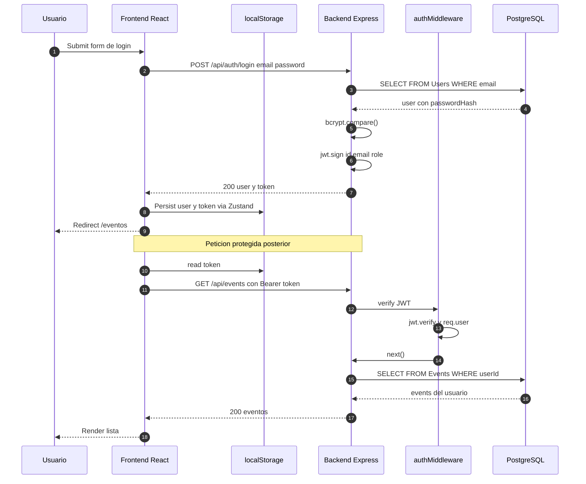

### Patrones aplicados

| Patrón | Dónde | Por qué |
|---|---|---|
| **MVC + Validators** | Backend | Separación de responsabilidades clásica de Express |
| **Service layer** | Frontend (`services/`) | Toda la comunicación HTTP centralizada y tipada |
| **App factory** | `server/src/app.js` | `createApp()` permite tests con Supertest sin abrir puerto |
| **Interceptor pattern** | `client/src/services/api.ts` | Inyección automática del token + manejo central de 401 |
| **Store persistido** | Zustand + `persist` | Sesión sobrevive a refresh con clave `auth-storage` |
| **Protected Route** | `<ProtectedRoute>` | Redirección a `/login` si no hay sesión |
| **Ownership check** | Controllers Events y Tickets | `if (resource.userId !== req.user.id) return 403` |
| **Centralized error middleware** | `error.middleware.js` | Respuestas JSON consistentes en todos los errores |

---

## 6. Instalación

### Requisitos previos

- **Node.js ≥ 18** y **npm ≥ 9**.
- **PostgreSQL ≥ 14** corriendo en `localhost:5432`.
- **Git**.

### Pasos

```bash
# 1. Clonar el repositorio
git clone https://github.com/JesusGG2109/ticket-generator.git
cd ticket-generator

# 2. Crear la base de datos en PostgreSQL
psql -U postgres -c "CREATE DATABASE eventhub_tecnm;"

# 3. Instalar dependencias del backend
cd server
npm install

# 4. Configurar variables de entorno del backend
cp .env.example .env
# Editar server/.env con tus credenciales

# 5. Instalar dependencias del frontend
cd ../client
npm install

# 6. (Opcional) Configurar variables del frontend
cp .env.example .env
```

La sincronización de tablas (`sequelize.sync()`) ocurre **automáticamente al arrancar el backend en modo desarrollo**. En producción se desactiva por seguridad — debe usarse `sequelize-cli` o migraciones manuales.

---

## 7. Variables de entorno

### Backend — `server/.env`

| Variable | Descripción | Ejemplo |
|---|---|---|
| `NODE_ENV` | Entorno (`development` / `production` / `test`) | `development` |
| `PORT` | Puerto donde escucha Express | `3000` |
| `DB_NAME` | Nombre de la base de datos | `eventhub_tecnm` |
| `DB_USER` | Usuario PostgreSQL | `postgres` |
| `DB_PASSWORD` | Contraseña PostgreSQL | `tu_password_seguro` |
| `DB_HOST` | Host de la base de datos | `localhost` |
| `DB_PORT` | Puerto PostgreSQL | `5432` |
| `JWT_SECRET` | Secreto para firmar JWT (cambiar en producción) | cadena larga aleatoria |
| `JWT_EXPIRES_IN` | Tiempo de vida del token | `7d` |
| `CORS_ORIGIN` | Origen(es) permitido(s) — `*` o lista separada por comas | `*` |

### Frontend — `client/.env`

| Variable | Descripción | Ejemplo |
|---|---|---|
| `VITE_API_URL` | URL base de la API. Si se omite, usa `http://localhost:3000/api` | `https://api.tudominio.com/api` |

> **Seguridad**: ambos archivos `.env` están en `.gitignore` y **nunca deben commitearse**. Solo `.env.example` se versiona.

---

## 8. Ejecución

### Modo desarrollo

**Backend** (terminal 1):

```bash
cd server
npm run dev
```

Salida esperada:
```
[nodemon] starting `node src/index.js`
Servidor corriendo en puerto 3000
Base de datos conectada
Tablas sincronizadas
```

**Frontend** (terminal 2):

```bash
cd client
npm run dev
```

Salida esperada:
```
VITE v7.1.14  ready in 421 ms
➜  Local:   http://localhost:5173/
```

Abrir [http://localhost:5173](http://localhost:5173) en el navegador.

### Modo producción

```bash
# Backend
cd server
npm install --omit=dev
NODE_ENV=production npm start

# Frontend
cd client
npm install
npm run build
npm run preview
```

El `dist/` del cliente puede desplegarse en Vercel/Netlify; el `server/` en Render/Railway/Fly.io.

### Scripts disponibles

**Backend** (`server/package.json`):

| Script | Acción |
|---|---|
| `npm run dev` | Arranca con nodemon (hot reload) |
| `npm start` | Arranca con node (modo producción) |
| `npm test` | Ejecuta los 50 tests con Jest |
| `npm run test:watch` | Tests en modo watch |

**Frontend** (`client/package.json`):

| Script | Acción |
|---|---|
| `npm run dev` | Arranca Vite dev server |
| `npm run build` | Compila TypeScript y genera build optimizado |
| `npm run preview` | Sirve el build localmente |
| `npm run lint` | ESLint sobre todo el código |

---

## 9. API REST

> **Base URL:** `http://localhost:3000/api`
> **Documentación interactiva:** `/api/docs` (Swagger UI con autenticación JWT)
> **Spec JSON:** `/api/docs.json` (OpenAPI 3.0.3 importable a Postman/Insomnia)

### Auth

| Método | Ruta | Protegido | Descripción |
|---|---|:---:|---|
| `POST` | `/auth/register` | — | Crea usuario y devuelve JWT |
| `POST` | `/auth/login` | — | Autentica y devuelve JWT |
| `GET` | `/auth/me` | 🔒 | Devuelve el usuario autenticado |

**`POST /api/auth/register`** — request:
```json
{
  "name": "Jesus Garcia",
  "email": "jesus@tecnm.mx",
  "password": "secret123"
}
```

Response `201`:
```json
{
  "user": { "id": 1, "name": "Jesus Garcia", "email": "jesus@tecnm.mx", "role": "user" },
  "token": "eyJhbGciOiJIUzI1NiIsInR5cCI6IkpXVCJ9..."
}
```

### Events

> **Todas las rutas requieren JWT y devuelven únicamente los eventos del usuario autenticado.**

| Método | Ruta | Protegido | Descripción |
|---|---|:---:|---|
| `GET` | `/events` | 🔒 | Lista los eventos del usuario |
| `POST` | `/events` | 🔒 | Crea un evento asociado al usuario |
| `GET` | `/events/:id` | 🔒 | Obtiene un evento propio por ID |
| `PUT` | `/events/:id` | 🔒 | Actualiza un evento propio |
| `DELETE` | `/events/:id` | 🔒 | Elimina un evento propio |

### Tickets

> **Todas las rutas requieren JWT. Cada usuario solo ve y manipula sus propios tickets.**

| Método | Ruta | Protegido | Descripción |
|---|---|:---:|---|
| `POST` | `/tickets` | 🔒 | Crea un ticket asociado al usuario |
| `GET` | `/tickets/me` | 🔒 | Lista los tickets del usuario (más reciente primero) |
| `GET` | `/tickets/:id` | 🔒 | Obtiene un ticket propio por ID |
| `DELETE` | `/tickets/:id` | 🔒 | Elimina un ticket propio |

### Códigos de error

| Código | Significado |
|---|---|
| `400` | Datos inválidos (Zod) / JSON malformado / ID no numérico |
| `401` | No autenticado / token inválido / token expirado |
| `403` | El recurso pertenece a otro usuario |
| `404` | Recurso no encontrado |
| `409` | Email ya registrado |
| `413` | Payload demasiado grande |
| `500` | Error interno (sanitizado en producción) |

### Utilidades

| Método | Ruta | Descripción |
|---|---|---|
| `GET` | `/` | Bienvenida |
| `GET` | `/api/health` | Healthcheck (uptime, environment, timestamp) |
| `GET` | `/api/docs` | Swagger UI |
| `GET` | `/api/docs.json` | Spec OpenAPI 3.0.3 |

---

## 10. Base de datos

### Modelo entidad-relación

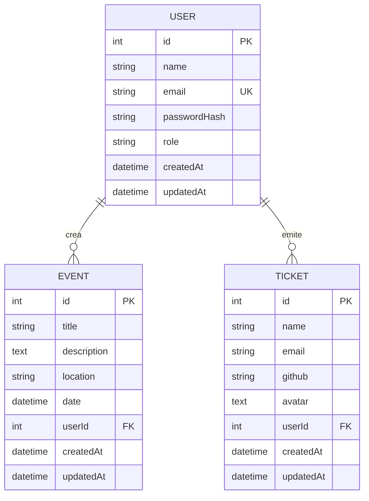

### Asociaciones Sequelize

```js
// server/src/models/index.js
User.hasMany(Event,  { foreignKey: "userId", as: "events",  onDelete: "SET NULL" });
Event.belongsTo(User, { foreignKey: "userId", as: "owner" });

User.hasMany(Ticket, { foreignKey: "userId", as: "tickets", onDelete: "CASCADE" });
Ticket.belongsTo(User, { foreignKey: "userId", as: "owner" });
```

**Decisión técnica:** los eventos usan `SET NULL` al borrar usuario (un evento puede quedar huérfano sin destruirse), mientras que los tickets usan `CASCADE` (al borrar un usuario, sus tickets se borran con él porque carecen de sentido independiente).

---

## 11. Flujo de usuario

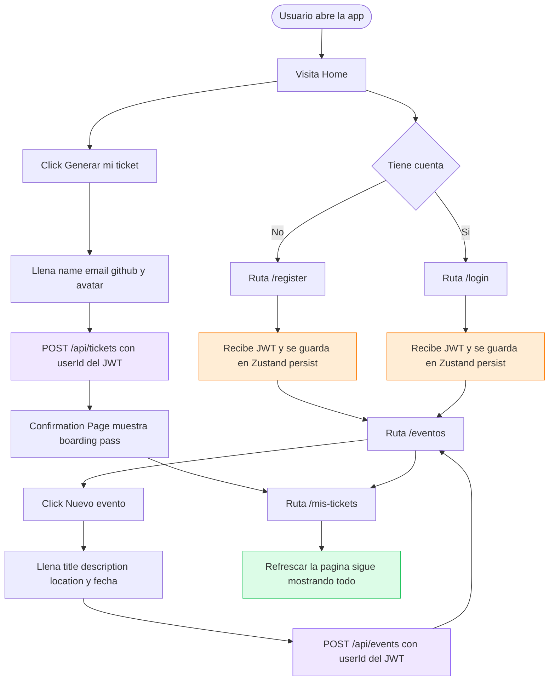

---

## 12. Estructura del proyecto

```
conference-ticket-generator/
├── .claude/                              # Launch configs locales
│   └── launch.json
├── docs/
│   └── images/                           # Capturas referenciadas en el README
│
├── client/                               # ── FRONTEND (React + Vite) ──
│   ├── public/
│   ├── src/
│   │   ├── assets/
│   │   ├── components/
│   │   │   ├── auth/                     # login-form, register-form, protected-route
│   │   │   ├── confirmation-page/        # congrats, ticket, ticket-card
│   │   │   ├── events-list/              # events-list, event-form
│   │   │   ├── layouts/                  # main-layout, starfield (lava lamps)
│   │   │   └── ticket-form-page/         # hero + form/{text-input, upload-input, button}
│   │   ├── contexts/                     # show-ticket
│   │   ├── hooks/                        # use-show-ticket
│   │   ├── pages/                        # home, events, login, register, my-tickets
│   │   ├── services/                     # api, authService, eventService, ticketService
│   │   ├── store/                        # auth (persist), user
│   │   ├── App.tsx
│   │   ├── main.tsx
│   │   └── index.css
│   ├── index.html
│   ├── package.json
│   ├── tsconfig.json
│   ├── vite.config.ts
│   └── .env.example
│
├── server/                               # ── BACKEND (Node + Express) ──
│   ├── src/
│   │   ├── config/                       # database, swagger
│   │   ├── controllers/                  # auth, event, ticket (con ownership check)
│   │   ├── middlewares/                  # auth, error, validateId
│   │   ├── models/                       # User, Event, Ticket + asociaciones
│   │   ├── routes/                       # auth, event, ticket
│   │   ├── validators/                   # auth, event, ticket (Zod)
│   │   ├── app.js                        # Factory createApp() — testeable
│   │   └── index.js                      # Bootstrap: env + listen
│   ├── tests/                            # 50 tests con Jest + Supertest
│   ├── jest.config.js
│   ├── package.json
│   ├── .env.example
│   └── .env                              # NO commiteado
│
├── .gitignore
└── README.md
```

---

## 13. Testing

El backend tiene **50 tests automatizados** con **Jest 30 + Supertest** corriendo contra una base **SQLite en memoria** vía Sequelize. Esto permite ejecutar la suite sin necesidad de Postgres y garantiza aislamiento total entre tests.

### Ejecutar

```bash
cd server
npm test            # Toda la suite
npm run test:watch  # Modo watch
```

### Suites incluidas

| Archivo | Cobertura | Tests |
|---|---|:---:|
| `tests/health.test.js` | Bootstrap de Express + dialect SQLite | 2 |
| `tests/auth.test.js` | Register, login, GET /me | 12 |
| `tests/events.test.js` | CRUD eventos + 5 tests de aislamiento entre usuarios | 19 |
| `tests/tickets.test.js` | CRUD tickets + 4 tests de aislamiento + orden DESC | 17 |
| **Total** | | **50** |

### Cómo funciona el entorno de test

- `tests/env.js` establece `NODE_ENV=test` y un `JWT_SECRET` de prueba.
- `server/src/config/database.js` detecta `NODE_ENV === "test"` y usa `sqlite::memory:` en lugar de Postgres.
- Cada suite hace `sequelize.sync({ force: true })` y un `truncate` por `beforeEach` para garantizar aislamiento.
- `server/src/app.js` exporta una factory `createApp()` que Supertest importa sin levantar puerto real.

---

## 14. Metodología

Durante el desarrollo se aplicaron conceptos de **Ingeniería de Software** vistos en la asignatura, organizando el trabajo en torno a los siguientes elementos:

- **Product Backlog** — lista de funcionalidades priorizadas según los requisitos del profesor.
- **Sprint Planning** — planeación por ciclos de trabajo en los que se definían las tareas a abordar.
- **Sprint Management** — seguimiento del estado de cada tarea durante el sprint.
- **GitHub Projects** — herramienta utilizada para gestionar el backlog y los sprints de forma colaborativa.
- **Control de versiones con Git** — ramas de trabajo (`jesus-dev`) separadas de `main`, commits semánticos en español agrupados por funcionalidad, y un historial revisable de principio a fin.

La metodología no se aplicó como un proceso formal certificado, sino como un **ejercicio práctico** para experimentar con las herramientas y conceptos en un proyecto real del semestre.

---

## 15. Artefactos del proyecto

Los artefactos de gestión asociados al proyecto se administraron mediante **GitHub Projects**, que ofrece una vista de tablero (kanban) y de tabla integrada con los issues y pull requests del repositorio.

Como parte del trabajo se utilizaron:

- **Product Backlog**
- **Sprint 1**
- **Sprint 3**
- **Sprint Management**

Estos elementos viven directamente en el espacio de **GitHub Projects** vinculado al repositorio, no como archivos dentro del código fuente. La consulta de los mismos se realiza desde la pestaña *Projects* del repositorio en GitHub, manteniendo el historial de cambios y movimientos de cada tarjeta.

---

## 16. Decisiones de ingeniería de software

### Por qué arquitectura cliente-servidor desacoplada

El `client/` y `server/` viven en directorios independientes con `package.json` separados. Esto permite desplegar cada uno en plataformas especializadas (Vercel/Netlify para SPAs, Render/Railway para APIs Node), iterar en frontend sin reiniciar el backend y viceversa, y migrar el frontend a otro framework sin tocar el backend.

### Por qué JWT en lugar de sesiones cookie-based

- **Stateless**: el backend no necesita guardar estado de sesión.
- **Portable**: el token funciona desde Postman, curl, móvil sin configuración adicional.
- **Escalable**: cualquier instancia del backend puede verificar el token sin coordinación.
- **Mockeable en tests**: Supertest envía el header sin manejar cookies.

### Por qué Zustand en lugar de Redux

- **80% menos boilerplate**: tres líneas para un store básico.
- **Middleware `persist` integrado**: una opción para persistir en localStorage.
- **Sin Provider obligatorio**: cualquier componente accede directo al store.

### Por qué Zod

- **Inferencia de tipos TypeScript** desde el schema sin duplicación.
- **Mensajes de error personalizados** definidos en el propio schema.
- **API moderna** con `.parse()` y `.safeParse()`.

### Por qué Sequelize

- Mayor portabilidad entre Postgres / MySQL / SQLite sin cambios de código.
- No requiere paso de generación adicional al build.
- Soporta el uso de SQLite en memoria para tests, lo cual fue determinante para el suite de 50 pruebas.

### Por qué Swagger desde JSDoc

- La documentación vive **junto al código** que documenta.
- Se mantiene actualizada al modificar el endpoint.
- `swagger-ui-express` levanta la UI sin necesidad de servir HTML adicional.

### Por qué `mix-blend-mode: multiply` en las lava lamps

Sobre fondo claro, `multiply` produce colores saturados como tinta o acuarela. Cuando dos lavas se solapan, sus colores se mezclan cromáticamente (naranja + magenta = magenta-rojo profundo). Esto reproduce el efecto físico de una lámpara de lava real, en contraste con los blobs CSS planos típicos.

---

## 17. Retos encontrados

Durante el desarrollo aparecieron varios problemas no triviales que requirieron debugging profundo y refactorización deliberada.

### 17.1 Render bloqueado por z-index negativo

**Síntoma:** el fondo decorativo se renderizaba pero la pantalla seguía completamente plana.

**Causa raíz:** el `<Starfield>` usaba `position: fixed inset-0 -z-10`. El selector global aplicaba `background-color` al `#root`. Como el wrapper padre no creaba stacking context, el z-index negativo se escapaba al stacking context raíz y quedaba detrás del background sólido.

**Corrección:** una línea en `main-layout.tsx`: agregar la utility `isolate` (Tailwind para `isolation: isolate`). Esto crea un stacking context que actúa como techo.

### 17.2 Crash del backend tras refactor

**Síntoma:** `[nodemon] app crashed` aparecía sin stack trace visible.

**Causa raíz:** `sequelize.sync()` no tenía `.catch()`. En Node 15+ una unhandled promise rejection mata el proceso.

**Corrección:** se agregaron `process.on('unhandledRejection')`, `process.on('uncaughtException')` y `.catch()` explícito a `sync()`. También se creó `error.middleware.js` central para garantizar respuestas JSON.

### 17.3 Tickets desaparecían al refrescar

**Síntoma:** los tickets generados aparecían temporalmente y desaparecían al refrescar.

**Causa raíz:** el sistema de tickets era 100% client-side y vivía en memoria. `store/user.ts` no tenía `persist`, el avatar era `URL.createObjectURL` (blob URL efímera), y la tabla `Tickets` no existía en el backend.

**Corrección:** se creó la entidad Ticket en backend (modelo, validador, controller, rutas, Swagger, 17 tests), un `ticketService.ts` en frontend, se reescribió `MyTicketsPage` para consumir el backend y se cambió el avatar a data URL persistible.

### 17.4 Cross-user data leak en eventos

**Síntoma:** todos los usuarios veían los mismos eventos.

**Causa raíz:** el modelo `Event` no tenía `userId` ni asociación. Las rutas eran completamente públicas.

**Corrección:** se agregó `userId` con FK, se declararon las asociaciones, se aplicó `authMiddleware` a las 5 rutas, se filtró por `WHERE userId = req.user.id`, y se agregó ownership check con respuesta 403. Reforzado con 5 tests de aislamiento.

### 17.5 Crash falso por procesos zombie

**Síntoma:** `[nodemon] app crashed` aunque el código estaba intacto y los tests pasaban.

**Causa raíz:** procesos node de iteraciones previas seguían vivos. Uno retenía el puerto 3000, así que el `app.listen(3000)` fallaba con `EADDRINUSE`.

**Corrección:** `Get-Process node | Stop-Process -Force` para limpiar zombies. No había bug en el código.

---

## 18. Resultados obtenidos

| Métrica | Valor |
|---|---|
| Commits semánticos | 60+ |
| Archivos fuente backend | 18 |
| Archivos fuente frontend | 27 |
| Tests automatizados | 50 (todos pasando) |
| Endpoints REST documentados | 12 |
| Tiempo de build frontend | ~280 ms |
| Tamaño bundle JS gzipped | ~112 KB |
| Tamaño bundle CSS gzipped | ~7.3 KB |
| Tiempo total de la suite de tests | ~7.5 segundos |

### Funcionalidades entregadas

- ✅ Sistema completo de autenticación JWT con persistencia y auto-logout.
- ✅ CRUD de eventos aislado por usuario con validación dual.
- ✅ Sistema de tickets persistente con boarding pass premium.
- ✅ Documentación API interactiva con Swagger UI.
- ✅ Suite de tests con SQLite en memoria.
- ✅ Tema visual luminoso premium con lava lamps animadas.
- ✅ Estructura preparada para deploy en plataformas modernas.

---

## 19. Equipo

### Integrantes

- **Jesús Grangeno García**
- **César Eduardo Martínez Arredondo**

El proyecto se desarrolló de forma colaborativa a lo largo del semestre. Durante las horas de clase se realizaron reuniones periódicas para coordinar el avance, dividir actividades, revisar lo construido y apoyar la integración de los módulos entre los integrantes del equipo.

Las contribuciones realizadas durante el desarrollo quedan reflejadas en el historial de commits del repositorio, accesible mediante:

```bash
git log --pretty=format:"%h %an %ad %s" --date=short
git shortlog -s -n
```

> El detalle granular de qué integrante realizó cada commit puede consultarse directamente en GitHub. Esta sección documenta únicamente el hecho colaborativo, sin asignar porcentajes de participación ni roles formales que no fueron definidos explícitamente durante el desarrollo.

---

## 20. Conclusiones

El proyecto **EventHub TECNM** demuestra de forma práctica los principios fundamentales de la **Ingeniería de Software** aplicados a un sistema web fullstack de complejidad moderada. La construcción se realizó de forma incremental, con commits semánticos en español que documentan cada decisión técnica y su justificación, lo cual permite auditar el proceso de desarrollo de principio a fin.

La separación clara entre frontend y backend en directorios independientes no fue una decisión estética sino una **decisión arquitectónica deliberada**: facilita el despliegue independiente, permite que cada capa evolucione a su propio ritmo y refleja la realidad industrial donde APIs y SPAs viven en infraestructuras distintas. La aplicación de patrones clásicos (MVC + Validators en backend, Service Layer + Interceptors en frontend, App Factory para testabilidad) demuestra que las soluciones probadas en la industria son perfectamente trasladables a un proyecto académico.

El proceso reveló problemas no triviales que solo aparecen en sistemas reales: stacking contexts CSS que ocultan elementos visualmente correctos, unhandled promise rejections que matan procesos silenciosamente, blob URLs que se evaporan al refrescar, y data leaks entre usuarios por ausencia de filtros en queries. Cada uno de estos retos fue **diagnosticado con metodología sistemática** (reproducir, aislar, hipotetizar, validar, corregir) en lugar de aplicar parches superficiales.

La **suite de 50 tests automatizados** con Jest + Supertest contra una base SQLite en memoria es probablemente el aporte más relevante desde la perspectiva de Ingeniería de Software. Demuestra que es posible escribir tests rápidos, aislados y deterministas para una API completa sin depender de bases de datos externas. Los tests específicos de aislamiento entre usuarios representan la prueba viva del compromiso del sistema con la seguridad multiusuario.

La **dirección visual del producto** se construyó como ejercicio de iteración crítica: se exploraron varios estilos antes de converger en una identidad luminosa coherente. Esta búsqueda demuestra que la **experiencia del usuario es un componente medible** del software profesional y que la calidad técnica debe acompañarse de una capa visual digna del producto. En conjunto, EventHub TECNM cumple los requisitos de la asignatura mientras ilustra cómo se diseña, construye, prueba, documenta y mantiene una aplicación web moderna con criterios profesionales aplicables al mundo laboral.

---

## 21. Futuras mejoras

### Funcionalidad
- [ ] **Roles y autorización** con `admin` y permisos elevados.
- [ ] **Filtros avanzados** de eventos por rango de fecha, ubicación, palabras clave.
- [ ] **Paginación** en `GET /events` y `GET /tickets/me`.
- [ ] **Notificaciones por correo** al generar un ticket o al acercarse la fecha del evento.
- [ ] **Generación de PDF** del boarding pass.
- [ ] **Código QR único** por ticket para validación en el evento.
- [ ] **Dashboard de organización** con métricas.

### Calidad técnica
- [ ] **Tipos compartidos** entre cliente y servidor.
- [ ] **Tests automatizados frontend** con Vitest + React Testing Library.
- [ ] **CI** con GitHub Actions (lint + build + test).
- [ ] **Migraciones Sequelize** en lugar de `sync()` para producción.
- [ ] **Rate limiting** y **Helmet** para endpoints públicos.

### Infraestructura
- [ ] **Deploy** en Render (backend) + Vercel (frontend).
- [ ] **Docker Compose** para arrancar Postgres + backend + frontend con un solo comando.
- [ ] **Monitoring** con Sentry o similar.

---

## 22. Licencia

Proyecto académico desarrollado para la asignatura de **Ingeniería de Software** en el **Tecnológico Nacional de México**. Uso libre con fines educativos citando la fuente y a los autores.

---

<div align="center">

**EventHub TECNM** · *Ingeniería de Software*

Jesús Grangeno García · César Eduardo Martínez Arredondo

[Reportar issue](https://github.com/JesusGG2109/ticket-generator/issues) · [Ver código](https://github.com/JesusGG2109/ticket-generator) · [GitHub Projects](https://github.com/JesusGG2109/ticket-generator/projects)

</div>
